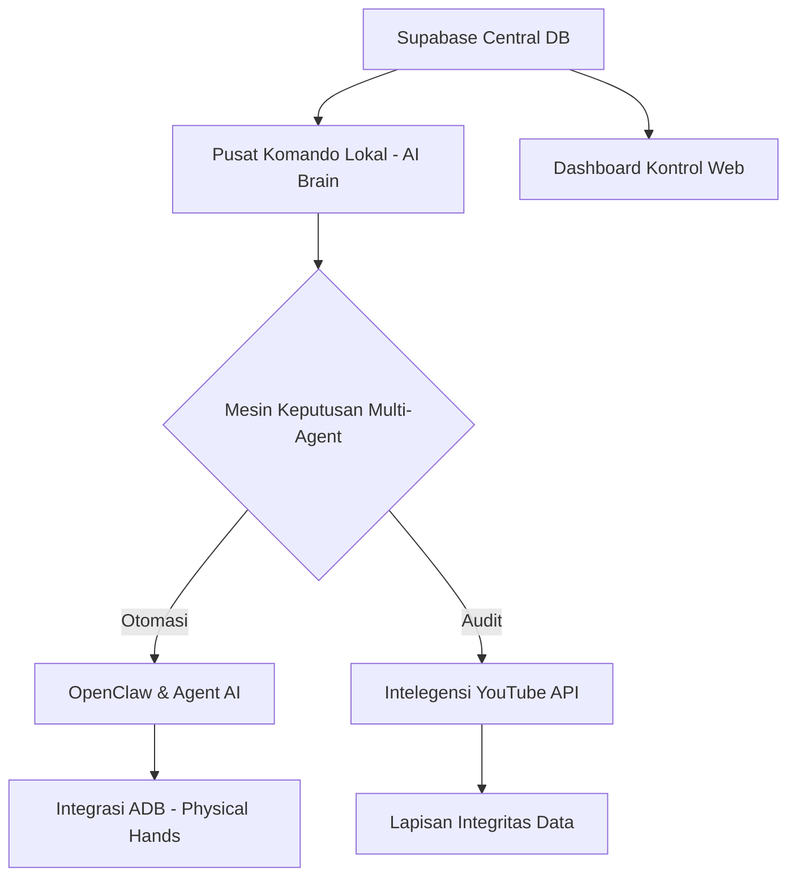

# 🌌 MASTERPLAN STRATEGIS: EKOSISTEM PINTARBOT OTONOM 🚀

> "Mewujudkan Intelegensi Buatan Otonom sebagai Pengganti Peran Manusia dalam Operasional Digital."

---

## 🧭 GAMBARAN ARSITEKTUR SISTEM

---

## 🏁 FASE 1: STABILISASI & INTEGRITAS DATA (COMPLETED)
*Membangun fondasi data yang akurat dan aman.*

*   💎 **Sistem YouTube Data API v3**: Migrasi dari metode scraping manual ke API resmi Google untuk menjamin akurasi data 100%.
*   🛡️ **Alur Audit Read-Only**: Implementasi sistem staging untuk konfirmasi manual sebelum data permanen ditulis ke database.
*   🔬 **Logika Audit Mendalam**: Deteksi otomatis channel bermasalah (Views < 10) dan status akun secara real-time.
*   🔄 **Sinkronisasi Dashboard**: Optimasi performa dashboard web untuk menangani data skala besar secara sinkron.

---

## 📅 FASE 2: OTOMASI OPERASIONAL (ON-GOING)
*Digitalisasi manajemen jadwal dan distribusi tugas.*

*   🎰 **Algoritma "Master 9" Modulo**: Sistem pembagian jadwal otomatis berbasis kelompok perangkat untuk efisiensi maksimal.
*   🎢 **Antrean Berkelanjutan (Continuous Queue)**: Distribusi jam upload yang mengalir secara otomatis dengan interval 15 menit.
*   🎲 **Randomisasi Dinamis**: Pengacakan urutan channel dan waktu mulai setiap hari untuk menghindari deteksi pola bot.
*   📝 **Sistem Konfirmasi Telegram**: Pelaporan rencana jadwal harian secara otomatis untuk diverifikasi oleh pengguna.

---

## 🧠 FASE 3: AMBISI "HUMAN REPLACEMENT" (AGENT AI & OPENCLAW)
*Transformasi PC Lokal menjadi asisten otonom pengganti peran manusia.*

*   🤖 **Orkestrasi Multi-Agent AI (The Brain)**:
    *   **Claude Opus 4.7**: Intelegensi utama untuk tugas ambisius, logika koding kompleks, dan asisten pribadi.
    *   **Claude Sonnet 4.6**: Eksekutor utama untuk efisiensi tugas harian dan otomasi rutin.
    *   **Gemini 3 Flash & Qwen 3.6**: Agen pendukung untuk pemrosesan data cepat dan variasi nalar.
*   🦞 **Implementasi Agen Otonom (OpenClaw)**:
    *   AI yang mampu mengoperasikan PC secara mandiri untuk manajemen email, dokumen, dan koding.
    *   **Google Account Protection**: Prosedur otomatis untuk mengamankan dan memantau kesehatan akun Google.
*   🎨 **Mesin Konten Kreatif**: Pembuatan prompt video dan pemilihan konten secara otomatis berbasis tren pasar.

---

## 🖥️ FASE 4: LOCAL COMMAND CENTER & EMBODIMENT (ADB MASTER)
*Integrasi kontrol fisik perangkat melalui pusat kendali lokal.*

*   🏠 **Infrastruktur On-Premise**: Menjadikan PC Lokal sebagai server pusat yang mengontrol seluruh perangkat fisik (HP) selama 24/7.
*   📱 **Integrasi Master ADB (Physical Hands)**:
    *   Koneksi otonom ke seluruh perangkat Android melalui protokol ADB.
    *   **Sistem Ganti Akun Otomatis**: AI mampu melakukan rotasi akun di setiap perangkat secara mandiri.
*   🎬 **Jalur Upload Otonom**: Eksekusi upload video secara langsung pada aplikasi YouTube di setiap perangkat sesuai jadwal.

---

## 🦾 FASE 5: TOTAL AUTONOMY (AGI LEVEL)
*Operasional tanpa intervensi manusia sedikit pun.*

*   👁️ **Vision-Based Navigation**: AI menggunakan kemampuan penglihatan (Computer Vision) untuk menavigasi antarmuka HP secara dinamis.
*   🛠️ **Sistem Self-Healing**: Bot mampu mendeteksi kendala koneksi atau error aplikasi dan melakukan perbaikan otomatis (restart/re-connect).
*   📊 **Analisis Strategis Otonom**: AI memberikan saran pengembangan bisnis berdasarkan performa data harian yang dikumpulkan secara otomatis.

---
*Dokumen Strategis PintarBot - April 2026*
